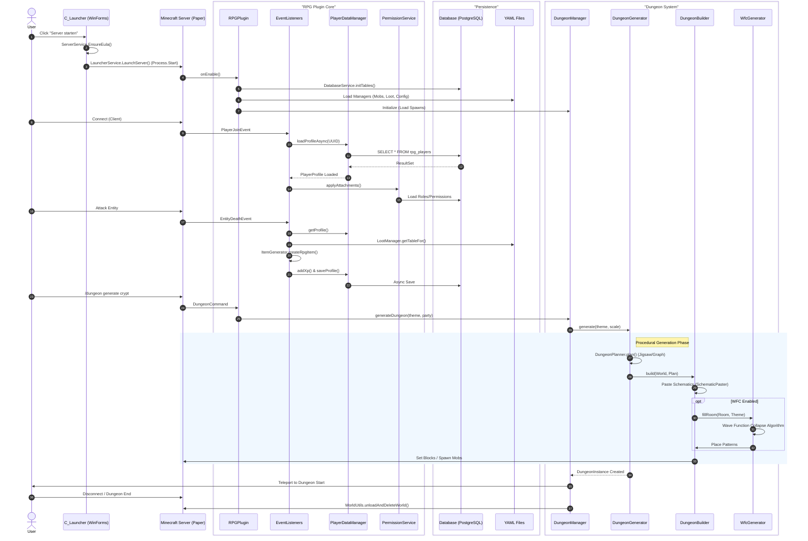

```mermaid
sequenceDiagram
    autonumber
    actor User
    participant Launcher as C_Launcher (WinForms)
    participant Server as Minecraft Server (Paper)
    
    box "RPG Plugin Core" #f9f9f9
        participant RPG as RPGPlugin
        participant Listeners as EventListeners
        participant PlayerMgr as PlayerDataManager
        participant Perms as PermissionService
    end

    box "Persistence" #e1e1e1
        participant DB as Database (PostgreSQL)
        participant Configs as YAML Files
    end

    box "Dungeon System" #e6f2ff
        participant DungeonMgr as DungeonManager
        participant Generator as DungeonGenerator
        participant Builder as DungeonBuilder
        participant WFC as WfcGenerator
    end

    %% Phase 1: Launcher & Server Startup
    User->>Launcher: Click "Server starten"
    Launcher->>Launcher: ServerService.EnsureEula()
    Launcher->>Server: LauncherService.LaunchServer() (Process.Start)
    Server->>RPG: onEnable()
    RPG->>DB: DatabaseService.initTables()
    RPG->>Configs: Load Managers (Mobs, Loot, Config)
    RPG->>DungeonMgr: Initialize (Load Spawns)

    %% Phase 2: Player Join & Data Load
    User->>Server: Connect (Client)
    Server->>Listeners: PlayerJoinEvent
    Listeners->>PlayerMgr: loadProfileAsync(UUID)
    PlayerMgr->>DB: SELECT * FROM rpg_players
    DB-->>PlayerMgr: ResultSet
    PlayerMgr-->>Listeners: PlayerProfile Loaded
    Listeners->>Perms: applyAttachments()
    Perms->>DB: Load Roles/Permissions

    %% Phase 3: Gameplay Loop (Combat & Loot)
    User->>Server: Attack Entity
    Server->>Listeners: EntityDeathEvent
    Listeners->>PlayerMgr: getProfile()
    Listeners->>Configs: LootManager.getTableFor()
    Listeners->>Listeners: ItemGenerator.createRpgItem()
    Listeners->>PlayerMgr: addXp() & saveProfile()
    PlayerMgr->>DB: Async Save

    %% Phase 4: Dungeon Generation (Complex Flow)
    User->>Server: /dungeon generate crypt
    Server->>RPG: DungeonCommand
    RPG->>DungeonMgr: generateDungeon(theme, party)
    DungeonMgr->>Generator: generate(theme, scale)
    
    rect rgb(240, 248, 255)
        note right of Generator: Procedural Generation Phase
        Generator->>Generator: DungeonPlanner.plan() (Jigsaw/Graph)
        Generator->>Builder: build(World, Plan)
        Builder->>Builder: Paste Schematics (SchematicPaster)
        
        opt WFC Enabled
            Builder->>WFC: fillRoom(Room, Theme)
            WFC->>WFC: Wave Function Collapse Algorithm
            WFC->>Builder: Place Patterns
        end
        
        Builder->>Server: Set Blocks / Spawn Mobs
    end

    Generator-->>DungeonMgr: DungeonInstance Created
    DungeonMgr->>User: Teleport to Dungeon Start

    %% Phase 5: Cleanup
    User->>Server: Disconnect / Dungeon End
    DungeonMgr->>Server: WorldUtils.unloadAndDeleteWorld()
```