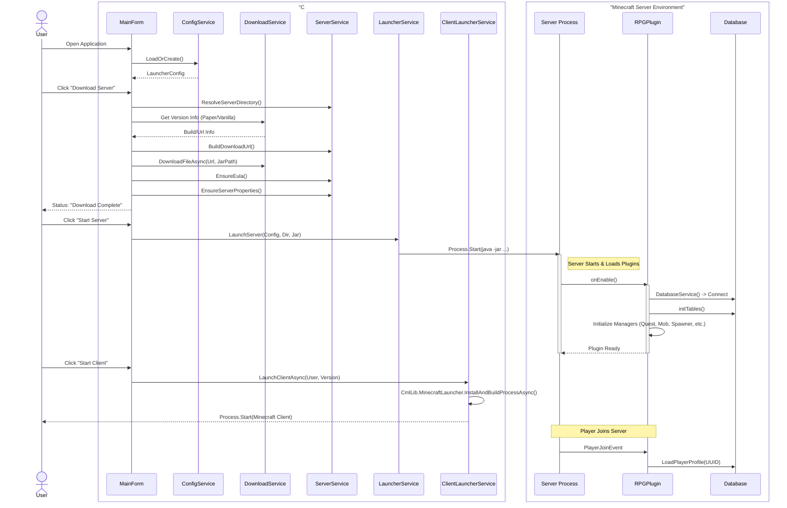

```mermaid
sequenceDiagram
    actor User
    box "C# Launcher Application" #1f2020
        participant GUI as MainForm
        participant CS as ConfigService
        participant DS as DownloadService
        participant SS as ServerService
        participant LS as LauncherService
        participant CLS as ClientLauncherService
    end
    box "Minecraft Server Environment" #2d303e
        participant SRV as Server Process
        participant RPG as RPGPlugin
        participant DB as Database
    end

    %% Initialization Phase
    User->>GUI: Open Application
    GUI->>CS: LoadOrCreate()
    CS-->>GUI: LauncherConfig

    %% Server Download Workflow
    User->>GUI: Click "Download Server"
    GUI->>SS: ResolveServerDirectory()
    GUI->>DS: Get Version Info (Paper/Vanilla)
    DS-->>GUI: Build/Url Info
    GUI->>SS: BuildDownloadUrl()
    GUI->>DS: DownloadFileAsync(Url, JarPath)
    GUI->>SS: EnsureEula()
    GUI->>SS: EnsureServerProperties()
    GUI-->>User: Status: "Download Complete"

    %% Server Launch Workflow
    User->>GUI: Click "Start Server"
    GUI->>LS: LaunchServer(Config, Dir, Jar)
    LS->>SRV: Process.Start(java -jar ...)
    activate SRV
    Note right of SRV: Server Starts & Loads Plugins
    SRV->>RPG: onEnable()
    activate RPG
    RPG->>DB: DatabaseService() -> Connect
    RPG->>DB: initTables()
    RPG->>RPG: Initialize Managers (Quest, Mob, Spawner, etc.)
    RPG-->>SRV: Plugin Ready
    deactivate RPG
    deactivate SRV

    %% Client Launch Workflow
    User->>GUI: Click "Start Client"
    GUI->>CLS: LaunchClientAsync(User, Version)
    CLS->>CLS: CmlLib.MinecraftLauncher.InstallAndBuildProcessAsync()
    CLS-->>User: Process.Start(Minecraft Client)

    %% Gameplay Interaction (Example)
    Note over SRV, RPG: Player Joins Server
    SRV->>RPG: PlayerJoinEvent
    RPG->>DB: LoadPlayerProfile(UUID)
```