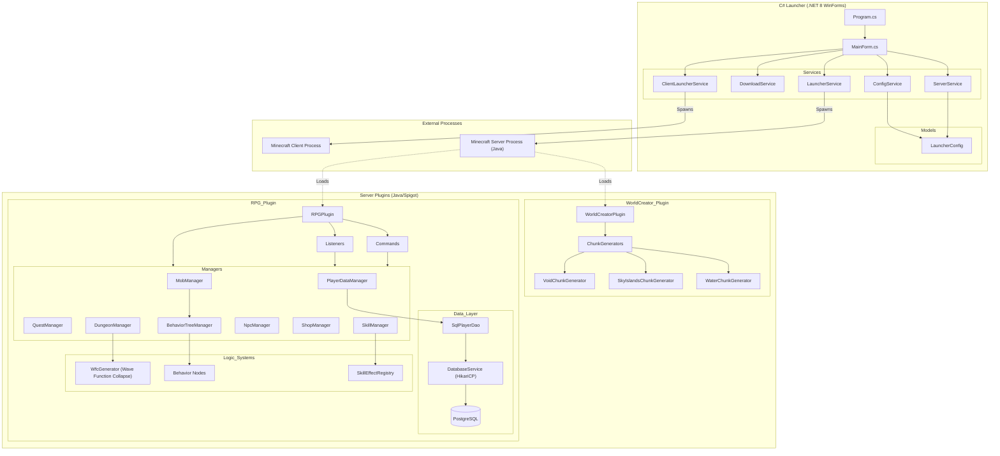

```mermaid
flowchart TD
    subgraph CSharp_Launcher ["C# Launcher (.NET 8 WinForms)"]
        Program[Program.cs] --> MainForm[MainForm.cs]
        
        subgraph Services
            ConfigSvc[ConfigService]
            DownloadSvc[DownloadService]
            ServerSvc[ServerService]
            LaunchSvc[LauncherService]
            ClientLaunchSvc[ClientLauncherService]
        end
        
        subgraph Models
            ConfigModel[LauncherConfig]
        end

        MainForm --> ConfigSvc
        MainForm --> DownloadSvc
        MainForm --> ServerSvc
        MainForm --> LaunchSvc
        MainForm --> ClientLaunchSvc
        
        ConfigSvc --> ConfigModel
        ServerSvc --> ConfigModel
    end

    subgraph External_Processes ["External Processes"]
        MC_Client["Minecraft Client Process"]
        MC_Server["Minecraft Server Process (Java)"]
    end

    LaunchSvc -- Spawns --> MC_Server
    ClientLaunchSvc -- Spawns --> MC_Client

    subgraph Minecraft_Plugins ["Server Plugins (Java/Spigot)"]
        direction TB
        
        subgraph WorldCreator_Plugin
            WC_Main[WorldCreatorPlugin] --> Generators[ChunkGenerators]
            Generators --> VoidGen[VoidChunkGenerator]
            Generators --> SkyGen[SkyIslandsChunkGenerator]
            Generators --> WaterGen[WaterChunkGenerator]
        end

        subgraph RPG_Plugin
            RPG_Main[RPGPlugin] --> Managers
            RPG_Main --> Listeners
            RPG_Main --> Commands

            subgraph Data_Layer
                DB_Svc["DatabaseService (HikariCP)"]
                PlayerDao[SqlPlayerDao]
                DB_Svc --> PostgreSQL[(PostgreSQL)]
                PlayerDao --> DB_Svc
            end

            subgraph Managers
                PlayerDataMgr[PlayerDataManager]
                QuestMgr[QuestManager]
                SkillMgr[SkillManager]
                DungeonMgr[DungeonManager]
                MobMgr[MobManager]
                NpcMgr[NpcManager]
                ShopMgr[ShopManager]
                BehaviorMgr[BehaviorTreeManager]
            end

            subgraph Logic_Systems
                WFC["WfcGenerator (Wave Function Collapse)"]
                BehaviorTree[Behavior Nodes]
                SkillEffects[SkillEffectRegistry]
            end

            PlayerDataMgr --> PlayerDao
            DungeonMgr --> WFC
            MobMgr --> BehaviorMgr
            BehaviorMgr --> BehaviorTree
            SkillMgr --> SkillEffects
            
            Listeners --> Managers
            Commands --> Managers
        end
        
        MC_Server -. Loads .-> WC_Main
        MC_Server -. Loads .-> RPG_Main
    end
```